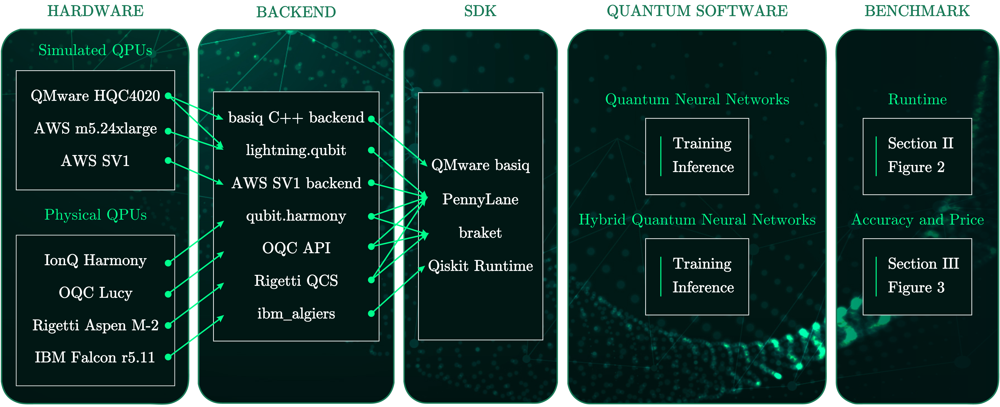
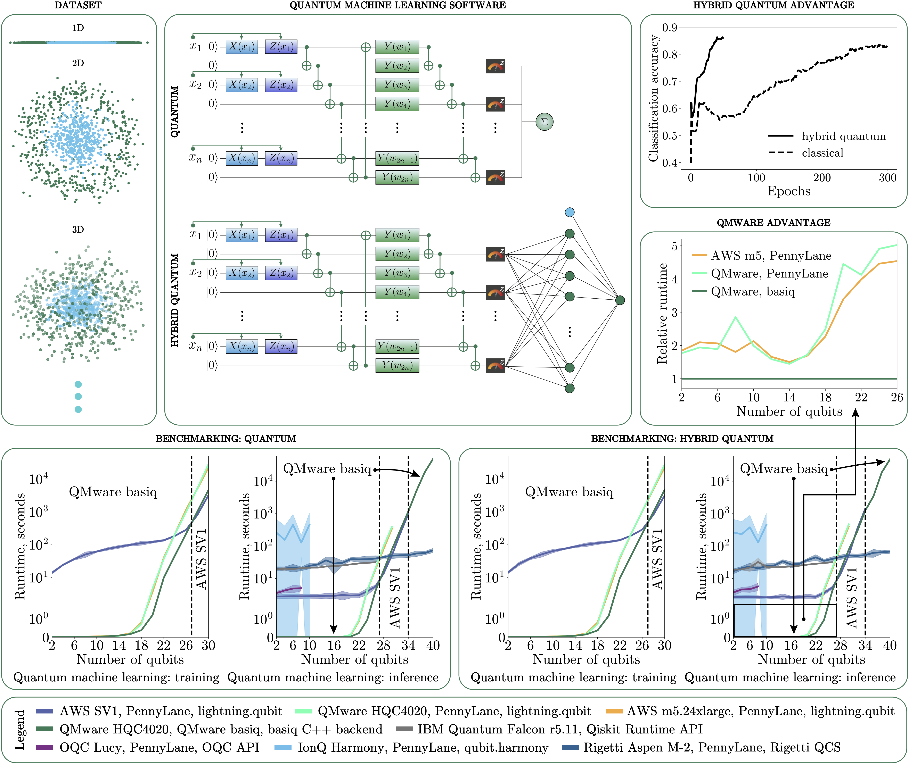
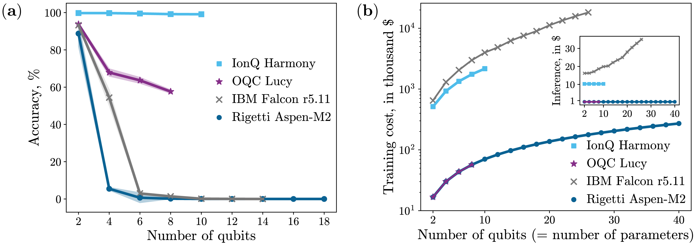
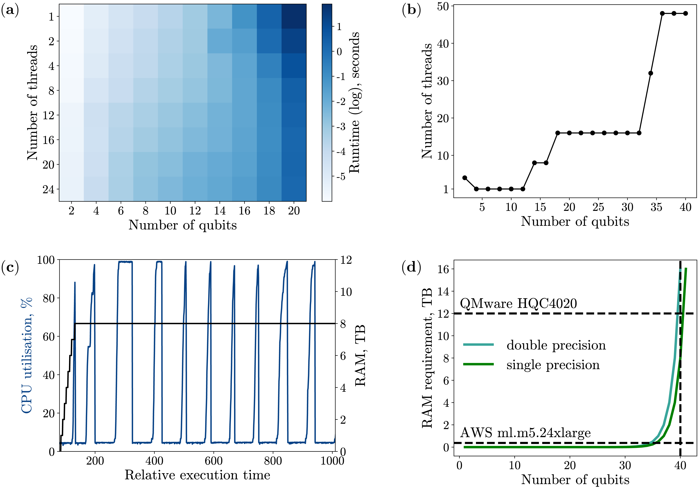

# Benchmarking Physical & Simulated QPUs

This GitHub repo corresponds to our work in the benchmarking paper https://arxiv.org/abs/2211.15631.


## Abstract

Powerful hardware services and software libraries are vital tools for quickly and affordably designing, testing, and executing quantum algorithms. A robust large-scale study of how the performance of these platforms scales with the number of qubits is key to providing quantum solutions to challenging industry problems. Such an evaluation is difficult owing to the availability and price of physical quantum processing units. This work benchmarks the runtime and accuracy for a representative sample of specialized high-performance simulated and physical quantum processing units. Results show the QMware cloud computing service can reduce the runtime for executing a quantum circuit by up to 78% compared to the next fastest option for algorithms with fewer than 27 qubits. The AWS SV1 simulator offers a runtime advantage for larger circuits, up to the maximum 34 qubits available with SV1. Beyond this limit, QMware provides the ability to execute circuits as large as 40 qubits. Physical quantum devices, such as Rigetti's Aspen-M2, can provide an exponential runtime advantage for circuits with more than 30 qubits. However, the high financial cost of physical quantum processing units presents a serious barrier to practical use. Moreover, of the four quantum devices tested, only IonQ's Harmony achieves high fidelity with more than four qubits. This study paves the way to understanding the optimal combination of available software and hardware for executing practical quantum algorithms.

## Authors

- Mo Kordzanganeh
- Markus Buchberger
- Basil Kyriacou
- Maxim Povolotskii
- Wilhelm Fischer
- Andrii Kurkin
- Wilfrid Somogyi
- Asel Sagingalieva
- Markus Pflitsch
- Alexey Melnikov


## Description

We benchmarked a multitude of quantum computing SDKs and platform on various CPUs and QPUs.   



The scheme for the benchmark. Simulated and native QPU stacks are benchmarked in the present work using open-source software and proprietary software on AWS, IonQ, OQC, Rigetti, IBM, and QMware.




Overview of benchmarking methodology and results. Boxes clockwise from top left: examples of the $n_d$-dimensional dataset used for benchmarking for $n_d = 1, 2, 3$, each containing $m = 500$ data points; the architecture of the pure quantum (top) and hybrid (bottom) neural networks used for the benchmarking calculations; the classification accuracy of the HQNN and an equivalent classical neural network, illustrating the improved learning rate of a hybrid approach; the relative runtime of different software and hardware stacks for a range of circuit sizes, showing the performance advantage of the basiq SDK using QMware's cloud computing service; training (left) and inference (right) runtime for the HQNN on various simulator software and hardware stacks; training (left) and inference (right) runtime for the pure QNN on various simulator software and hardware stacks (see legend at bottom). Dashed lines in the runtime plots illustrate the most performant stack for a given range of qubits. The inference plots in both cases also illustrate the runtime using real QPUs.




Comparison of circuit fidelity (left), training cost (right) and inference cost (inset) for various publicly available QPUs. The training price estimates are calculated on the assumption that the model is trained over 100 epochs, with 100 training samples and 1000 circuit shots per expectation value. For IBM Falcon r5.11 the prices are obtained in CHF and the conversion is calculated using a rate of 1.06 USD = 1.00 CHF. Note that the IBM Cloud Estimator service offers a method for circuit training that could reduce the IBM prices by up to 2 orders of magnitude.



Hardware statistics for the QMware HQC4020 simulator. (a) The optimal number of threads for simulating an $n$-qubit quantum circuit. Faster runtimes are indicated with a paler shade, demonstrating how the optimal number of threads varies for increasing circuit size. (b) A plot of the optimum thread count against number of qubits (c) A plot of total CPU and RAM utilization over time during the execution of a 40 qubit QNN. (d) Memory required to store the state vector for an increasing number of qubits.

## Citing this work

If you use the code or data in this package, please cite:

```bibtex
@article{kordzanganeh2022benchmarking,
  title={Benchmarking simulated and physical quantum processing units using quantum and hybrid algorithms},
  author={Kordzanganeh, Mohammad and Buchberger, Markus and Kyriacou, Basil and Povolotskii, Maxim and Fischer, Wilhelm and Kurkin, Andrii and Somogyi, Wilfrid and Sagingalieva, Asel and Pflitsch, Markus and Melnikov, Alexey},
  journal={arXiv preprint arXiv:2211.15631},
  year={2022}
}```
